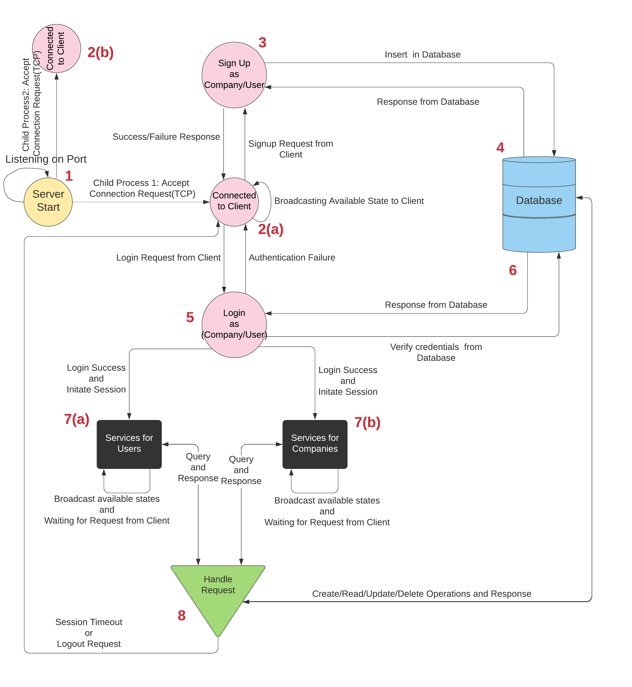
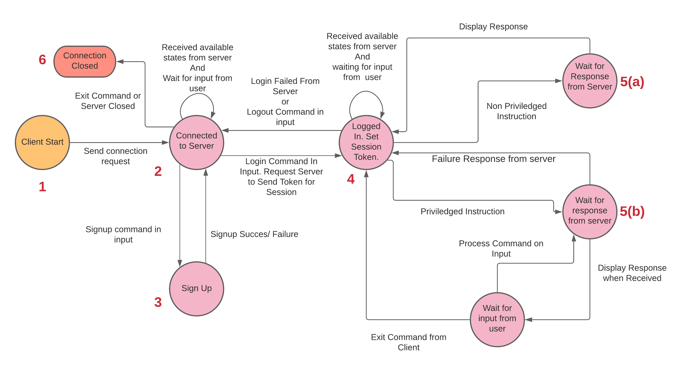

# Mini-LinkedIn

Mini-LinkedIn is a program using networking paradigms that supports important LinkedIn features like feed, job posting and searching, connecting and networking, creating companies, and building profiles. Mini-LinkedIn consists of several different features, taking inspiration from the popular social networking platform LinkedIn. The server and client model for Mini-LinkedIn work on TCP protocol, where the server serves the requests by the client(s). The server interacts with the database to retrieve, insert, delete and update data of the users/companies. 

## Overall Structure

The client-server-database architecture is shown below.

## Server Architecture

The server broadcasts its available states (routes) to the client and serves the requests by transitioning into appropriate states by receiving and/or sending data to the client. The server maintains session information regarding each client. The server acts as a finite state machine(FSM) as shown below.

## Client Architecture

Privileged features like updating profile, getting feed etc. are not accessible by the client without login. After logging in, the session is available for a limited duration and the client is logged out if the session expires or if the client chooses to logout. The client architecture is shown below.

## Features

* The client is able to register and set up an account either as a company or normal user. 
* The client is able to login and logout with Mini-LinkedIn. 
* Users are able to set up a custom profile with fields like skills, about, experience etc. in case of a user profile and set fields like company name, about etc. in case of a company profile.
* Users are able to send and accept connection requests from other users.
* Users are able to create LinkedIn posts, like posts and view posts of their connections.
* Display the number of users who viewed a person’s profile.
* Display the information of users who endorse specific skills.
* Only companies are able to post job updates. All the registered users can search for job postings with skill filters.
* Companies are able to see the users who have applied for the job they posted.
* The server is a concurrent program that can handle several client requests. 
* Users are authenticated with the server before trying to access any of the features. 
* When a user is prompted for a Login password, the user input for the password is obscured/masked.
* A user can only see the posts of users who are in their connection. 
* Job recommendations based on the skills provided by the user are provided.
* Connection recommendations are provided.
* Comments and multiple reactions (such as like, clap and support) on a connection’s post are provided.

## Instructions to Install Database

* Install MongoDB database for Ubuntu using instructions provided [here](https://docs.mongodb.com/manual/tutorial/install-mongodb-on-ubuntu/)

* Make sure that a local instance of mongodb is running by running `sudo systemctl status mongo` 
* Fire up the terminal and type `mongo`. Then type `use linkedin`. Then  type `exit`.

Configure the IP of your system in the /server/db/constants.js file for `MONGOURI` variable.
You can get the IP of your host using `ifconfig` command on Ubuntu.

## Instructions to Run

To run Mini-LinkedIn on host, 
* In the server and client folders, run `npm install`
* In the mininet folder run `pip3 install pickle` and `pip3 install faker`
* Use the command `node server.js localhost` to start the server from the directory `/server/`
* Use the command `node client.js localhost` to start the server from the directory `/client/`

Now follow the instructions on the terminal window of client.

## Instructions to Test on Mininet

* Install Mininet on VM by following the instructions provided [here](http://mininet.org/download/)
* Configure VM to setup "NAT Network" and "Host Only Network"

For Ubuntu 16.04 and less, there will be an `interfaces` file in `\etc\network\` directory. For more recent releases
copy the `interfaces` file from older versions and paste it in the directory. 

* In the mininet folder, run `sudo python3 mini_test_user.py` to run tests for user or run `sudo python3 mini_test_company.py` to run tests for company.