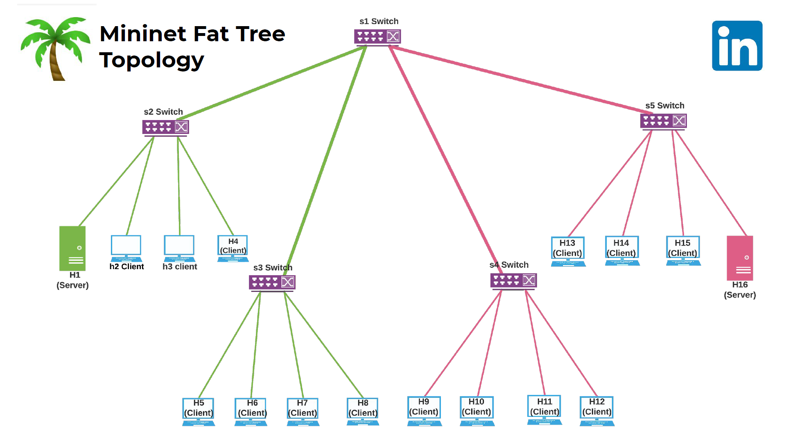

# Mini-LinkedIn ⭐

Mini-LinkedIn is a program using networking paradigms that supports important LinkedIn features like feed, job posting and searching, connecting and networking, creating companies, and building profiles. Mini-LinkedIn consists of several different features, taking inspiration from the popular social networking platform LinkedIn. The server and client model for Mini-LinkedIn work on TCP protocol, where the server serves the requests by the client(s). The server interacts with the database to retrieve, insert, delete and update data of the users/companies.

Refer [here](./architecture/Project_Proposal_Mini_LinkedIn.pdf) for our **project proposal** for Mini-LinkedIn.

Refer [here](./architecture/Mini-Linkedin_Presentation.pdf) for our **presentation slides** for Mini-LinkedIn.

Refer [here](./architecture/Mini-LinkedIn_Design_Document.pdf) for **detailed document** for design, architecture and testing.

Refer [here](https://drive.google.com/file/d/1vJW2BivOlTaVQUtTXIGNVeY_G1q-XK-u/view?usp=drivesdk) for **demonstration video** of our project. 

#
## Codebase Directory Architecture: 📁
#
```
Mini_LinkedIn
├─ README.md
├─ client
│  ├─ client.js
│  ├─ commands.js
│  ├─ package-lock.json
│  └─ package.json
├─ mininet
│  ├─ func_def.py
│  ├─ gen_data_company.py
│  ├─ gen_data_user.py
│  ├─ mini_test_company.py
│  ├─ mini_test_user.py
│  ├─ test_company.py
│  ├─ test_user.py
│  ├─ workload_company
│  │  ├─ address.txt
│  │  ├─ budget.txt
│  │  ├─ companyName.txt
│  │  ├─ description.txt
│  │  ├─ emails.txt
│  │  ├─ employmentType.txt
│  │  ├─ experience.txt
│  │  ├─ index.txt
│  │  ├─ indexOfApplicant.txt
│  │  ├─ indexOfJob.txt
│  │  ├─ industryType.txt
│  │  ├─ jobLocation.txt
│  │  ├─ jobTitle.txt
│  │  ├─ jobType.txt
│  │  ├─ password.txt
│  │  └─ skills.txt
│  └─ workload_user
│     ├─ address.txt
│     ├─ content.txt
│     ├─ emails.txt
│     ├─ fnames.txt
│     ├─ index.txt
│     ├─ indexOfJobs.txt
│     ├─ indexOfUser.txt
│     ├─ lnames.txt
│     ├─ password.txt
│     ├─ skills.txt
│     ├─ status.txt
│     ├─ title.txt
│     └─ viewUserIndex.txt
└─ server
   ├─ config.json
   ├─ db
   │  ├─ constants.js
   │  └─ db.js
   ├─ errorHandler.js
   ├─ feed
   │  ├─ companyFeed.js
   │  └─ userFeed.js
   ├─ models
   │  ├─ company.js
   │  ├─ jobPosting.js
   │  ├─ post.js
   │  └─ user.js
   ├─ modules
   │  ├─ databaseAPI.js
   │  ├─ helper.js
   │  ├─ jobs.js
   │  ├─ posts.js
   │  ├─ serverAPI.js
   │  └─ userControl.js
   ├─ package-lock.json
   ├─ package.json
   └─ server.js
```
#
## Overall Structure 🔥
#
The client-server-database architecture is shown below.


#
## Server Architecture 💻
#
The server broadcasts its available states (routes) to the client and serves the requests by transitioning into appropriate states by receiving and/or sending data to the client. The server maintains session information regarding each client. The server acts as a finite state machine(FSM) as shown below.


#
## Client Architecture 📲 
#
Privileged features like updating profile, getting feed etc. are not accessible by the client without login. After logging in, the session is available for a limited duration and the client is logged out if the session expires or if the client chooses to logout. The client architecture is shown below.


#
## Features and Use Cases ✅
#
```
✅ The client is able to register and set up an account either as a company or normal user. 
✅ The client is able to login and logout with Mini-LinkedIn. 
✅ Users are able to set up a custom profile with fields like skills, about, experience etc. in case of 
   a user profile and set fields like company name, about etc. in case of a company profile.
✅ Users are able to send and accept connection requests from other users.
✅ Users are able to create LinkedIn posts, like posts and view posts of their connections.
✅ Display the number of users who viewed a person’s profile.
✅ Display the information of users who endorse specific skills.
✅ Only companies are able to post job updates. All the registered users can search for job postings 
   with skill filters.
✅ Companies are able to see the users who have applied for the job they posted.
✅ The server is a concurrent program that can handle several client requests. 
✅ Users are authenticated with the server before trying to access any of the features. 
✅ When a user is prompted for a Login password, the user input for the password is obscured/masked.
✅ A user can only see the posts of users who are in their connection. 
✅ Job recommendations based on the skills provided by the user are provided.
✅ Connection recommendations are provided.
✅ Comments on post and multiple reactions (such as like, clap and support) on a connection’s post 
   are provided.
```

## Instructions to Install Database :arrow_down:

* Install MongoDB database for Ubuntu using instructions provided [here](https://docs.mongodb.com/manual/tutorial/install-mongodb-on-ubuntu/)

* Make sure that a local instance of mongodb is **running** by running `sudo systemctl status mongo` 
* Fire up the terminal and type `mongo`. Then type `use linkedin`. Then  type `exit`.

Configure the IP of your system in the /server/db/constants.js file for `MONGOURI` variable.
You can get the IP of your host using `ifconfig` command on Ubuntu.


## Instructions to Run :runner:

To run Mini-LinkedIn on host, 
* In the server and client folders, run `npm install`
* In the mininet folder run `pip3 install pickle` and `pip3 install faker`
* Use the command `node server.js localhost` to start the server from the directory `/server/`
* Use the command `node client.js localhost` to start the server from the directory `/client/`

Now follow the instructions on the terminal window of client.
#
## Available Commands (APIs) for Client :page_with_curl:
#
```
{
    '0':'exitProgram',
    '1':'login',       
    '2':'signUpUser',
    '3':'signUpCompany',
    '4':'logout', 
    '5':'getMyProfile',
    '6':'updateProfileUser', 
    '7':'deleteAccount',
    '8':'getMyFeed',    
    '9':'like',    
    '10':'clap',           
    '11':'support',
    '12':'acceptConnection',   
    '13':'sendConnection',   
    '14':'postJob', 
    '15':'createPost',
    '16':'searchJob',
    '17':'feedCompany',        
    '18':'endorseSkill',
    '19':'applyToJob', 
    '20':'viewProfileUser',
    '21':'viewProfileCompany',     
    '22':'connectionRecommendation',
    '23':'jobRecommendation', 
    '24':'commentOnPost'
}

```
#
## Instructions to Test on Mininet :page_with_curl:
#
* Install Mininet on VM by following the instructions provided [here](http://mininet.org/download/)
* Configure VM to setup "NAT Network" and "Host Only Network"

For Ubuntu 16.04 and less, there will be an `interfaces` file in `\etc\network\` directory. For more recent releases
copy the `interfaces` file from older versions and paste it in the directory. 

* Run `python3 gen_data_user.py` or `python3 gen_data_company.py` to generate workload for user and company respectively.
* In the mininet folder, run `sudo python3 mini_test_user.py` to run tests for user or run `sudo python3 mini_test_company.py` to run tests for company.

Note: We have used a fat tree topology for testing, with depth 2 and fanout 4. 
Here is the structure of the Fat tree topology: 

#
## Networking Paradigm :computer:
#
### Client and Server Interaction -

-  Since, TCP is a reliable data transfer protocol, all the transactions between client and server happens on TCP. The     server opens up a socket and listens, as soon as a client sends a connection request, a TCP connection is set up between the client and the server and is persistent for the entire communication between them until any one of them closes the connection. 

- These are the steps in data exchange - 
    - Data is encoded in a proper format by the sender which both the entities can understand.
    - It is payloaded directly in a TCP packet and sent to the receiver.
    - The receiver decodes data and takes appropriate actions.

- Here, sender/receiver can be both client and server.

- Hence, both the entities exchange data with TCP as the underlying protocol.

### Server and Database Interaction-

The server communicates and performs operations on the database directly by using APIs provided by the database (happens over HTTP).

#
## Implementation ▶️
#
### Client-Server - Node.js

Node.js is an open-source, cross platform runtime environment for executing JavaScript code outside of a browser. It works on an event based model requiring callback functions which provides better performance than traditional thread based models.

A TCP connection can be easily set up on Node.js using sockets that allows client-server interaction in Mini-LinkedIn. 

### Database - MongoDB

MongoDB is a document-based NoSQL database with powerful querying capabilities, flexible schemas which suit the requirements of the Mini-LinkedIn tool. It is nicely compatible with Node.js, offers code-native data access (APIs) for the server to work and has enough documentation.


## Protocol over TCP, Encoding and Decoding data in TCP packets

Data between the client and the server are sent by packing data into JSON format. After packing the data is sent via the TCP sockets in the server and the client. Both the client and the server parse the received data to perform the respective actions. 


### For sending one single request or response -

The entire JSON data (be it sending a request from client for some command or sending response from the server for a command from client) is first made into a string by stringifying the JSON. Then this string is converted into a raw string of hex. Depending on the buffer size defined on the client and the server side, we create chunks of the string. 

For each such complete raw string (formed from JSON) an end of response is marked using special characters ( EOI (End of Instruction) in our case ). Now, these packets are sent over TCP socket as a stream of bytes and are received by the other side socket. That socket keeps on collecting the received data, and checking at each stage if the EOI is received. 

### For receiving one single request or response -

The receiver receives raw text in a loop from the other party and tries to concatenate all the raw text received. For each text received, it also checks whether the current text is the end of this whole command’s response/request with the special end marked using special characters. When it detects the end of the message it sends the entire raw text string (that was formed by concatenating many packets) to the application logic where it can be parsed into JSON and processed and break current loop and go on for receiving next packets.

This is how the sender and receiver knows where a particular data ends which makes a transaction between client-server as request-response message.

Note: There is no extra overhead for sending JSON over TCP, as we stringify the JSON before sending it as a payload. Therefore, we are effectively sending a string over TCP and parsing that string at the other end of the connection.

#
## Security aspects 🔒
#
- As mentioned above, for every coming request from the client, the server verifies the token and command and then takes necessary action. If the authentication via the token fails the commands will not be handled by the server unless the client logins with proper credentials. 


- The client is not permitted to perform any command except login/sign up without logging in. 


- A user cannot access/use APIs for a company and a company cannot access/use the APIs for a user. For instance, only a user will be able to send connection requests to other users and a company cannot send connection requests. Similarly, a user will not be able to post jobs, only a company will be able to post jobs.  


- The passwords entered by the client are obscured using (*) symbol for security.


- All the data sent over TCP connection is encoded before sending. 


- A user can only see posts of users who are in their connection. Similarly, a user who is already a connection of another user, can’t send another connection request. Similarly, a liked post cannot be liked again by the same user.
